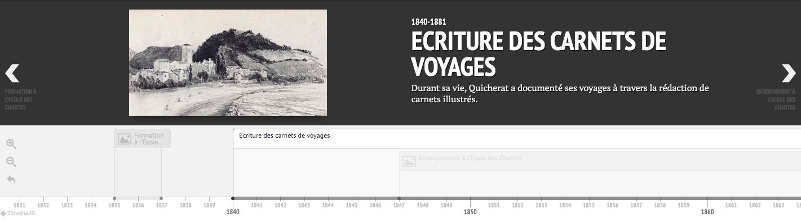

# VisualQuicherat


## Allers et retours d'un chartiste: récit de Jules Quicherat
Ce projet a été réalisé dans le cadre du Hackathon ADEMEC 2021 par l'équipe ALOA.

[Carnet de bord](https://github.com/ademec/ALOA/blob/main/Carnet%20de%20bord.pptx) | [Présentation exhaustive du projet](TexteQuicheratVF.html)

## Introduction

### Jules Quicherat

À la fois historien et archéologue, l’ensemble de la vie de Jules Quicherat s’inscrit en relation étroite avec l’École des Chartes. Issu de la promotion de 1837, il participe deux ans plus tard à la fondation de la société de l’École des Chartes. Nommé répétiteur d’archéologie, lors de la création de cet enseignement, il devient par la suite professeur titulaire de la chaire diplomatique. Sa carrière au sein de l’École des chartes se poursuit avec sa nomination en tant que directeur en 1871, poste qu’il occupe jusqu’à sa mort en 1882. L’ensemble de sa vie est jalonné par de nombreux voyages qu’il effectue sur l’ensemble du territoire français et ponctuellement dans d’autres pays européens. C’est à cette occasion qu’il entreprend la rédaction de carnets qui lui permettent de tracer ses différentes observations et qui constituent une porte d’entrée fascinante, tant sur son propre parcours que sur la production scientifique de son époque.

### Les carnets

Les carnets de Quicherat est un corpus documentaire initialement composé de 53 items parmi lesquels 43 sont désormais conservés aux Archives nationales sous la cote 93AJ/316, et ayant fait l’objet d’une numérisation. Chacun d’entre eux contient à la fois des annotations manuscrites – tant sur les lieux et édifices visités que sur le voyage en tant que tel – et des dessins sur les différents monuments et artefacts étudiés par Quicherat. Dans le cadre de cette analyse, seules les pages de carnets associées à une géolocalisation ont été exploitées.


## Projet: Les voyages de Quicherat, révélateurs du milieu scientifique de son époque

L’intérêt fort des carnets de Quicherat se situe à plusieurs niveaux. Outre une œuvre de terrain ayant servi à alimenter le travail de recherche de Jules Quicherat, ces documents sont à mettre en relation avec son enseignement et plus largement son impact au sein de l’École des Chartes. Ainsi, parmi les différents lieux et édifices visités, certains d’entre eux se retrouvent dans le cadre de sujets de thèses traités par les différentes promotions contemporaines ou postérieures à la période d’activité de Jules Quicherat à l’École des Chartes. Outre un indice sur l’influence et le rôle majeur que ce dernier a pu jouer au sein de cette institution, la mise en relation de ces différents ensembles documentaires donne également à voir comment la production historique peut s’engager.

Les carnets de Jules Quicherat sont également à remettre en perspective au sein du contexte de son époque. Il s’inscrit à ce titre dans la tradition des voyages pittoresques de l’époque romantique tels qu’initiés au début du XIXe siècle, par exemple, par le baron Taylor et Charles Nodier. Les dessins et lithographies produites à l’occasion de ces trajets sont alors un des éléments déclencheurs ayant permis une prise de conscience relative à la préservation des entités patrimoniales.

Jules Quicherat s’inscrit à ce titre dans cette tradition qui est également à mettre en lien avec son activité professionnelle. En tant qu’archéologue, il participe activement au développement de cette discipline en favorisant notamment l’étude directe des différents édifices. Dans cette optique, ces carnets s’apparentent à de véritables œuvres de terrain qui lui permettent également d’alimenter ses productions de recherche. C’est à cette fin que les différents lieux visités au cours de ces voyages seraient à croiser avec les différents articles produits par Jules Quicherat tout au long de sa vie professionnelle, dans la même lignée que le recoupement réalisé avec le jeu de données des positions de thèse. À cet égard, plusieurs sources pourraient être exploitées (catalogue de la bibliothèque de l’École des Chartes, base documentaire Worldcat, base Persée etc.). De façon complémentaire au travail réalisé en lien avec les positions de thèse, cette analyse permettrait donc de remettre en perspective les différents voyages de Jules Quicherat avec sa production scientifique.

Enfin, les voyages de Jules Quicherat sont également un moyen de le replacer au sein d’un contexte plus large des sociétés savantes. La cartographie réalisée permet de visualiser l’éventuel recoupement entre les lieux visités par Jules Quicherat et les implantations des différentes sociétés savantes de son époque, aboutissant ainsi à une géographie du milieu au sein duquel il évolue. Dans ce cadre, l’analyse pourrait être poussée en réalisant une océrisation des différentes notes prises par Jules Quicherat dans ses différents carnets afin de pouvoir réaliser une analyse plein texte. La recherche sur les individus mentionnés par Jules Quicherat, couplée à l’interrogation d’une base de données listant les membres de ces différentes sociétés savantes (ex : base prosopographie du CTHS), autoriserait d’étudier à quel point Jules Quicherat s’inscrit dans un véritable réseau à l’échelle du pays.

## Organisation du repository

```
|_ README.md
|_ LICENSE
|__ input_data
|__ output_data
|__ visualapp
|__ webcontenu
|__ preprocessing_files
|__ imgs
|__ ppt
```

## Contributions

### Webapp

La contribution principale de ce projet est une webapp proposant une analyse chrono-temporelle des voyages de Quicherat.

Le code de la webapp est accessible suivant ce path:

```
# Webapp
./webapp
````

### Les jeux de données

Nous avons affiné et constitué trois jeux de données (Carnets de voyages de Quicherat, Positions de thèse des anciens chartistes, Sociétés savantes) accessibles aux liens suivants:

```
# Carnet de voyages
./output_data/quicherat_voyages_geolocalises_images_avec_theses.csv

# Positions de thèse
./output_data/theses_with_location.csv

# Sociétés savantes
./output_data/societes_cths_1888_Presence_Quicherat.csv
````

**Carnet de voyages de Quicherat** ([jeu de données](./output_data/quicherat_voyages_geolocalises_images_avec_theses.csv)/[Carte des données](http://umap.openstreetmap.fr/fr/map/carte-des-pages-de-quicherat-geolocalisees_660906#11/46.5641/0.2815))

Il s'agit du jeu de données des Carnets de voyages de Quicherat aggrémenté d'information supplémentaire :
- travail sur la géolocalisation des carnets: localisations ADEMEC plus complètes et corrigées
- ajout d'un champ avec les thèses mentionnant les lieux visités par Jules Quicherat

**Positions de thèse** ([jeu de données](./output_data/theses_with_location.csv))

Il s'agit du jeu de données des positions de thèses des anciens chartistes.
- Il est completé avec les descriptions complètes des positions de thèse
- Extraction via NER des localités mentionnées par les positions de thèses

**Sociétés savantes** ([jeu de données](./output_data/societes_cths_1888_Presence_Quicherat.csv)/[Visulation des données](http://umap.openstreetmap.fr/fr/map/carte-des-pages-de-quicherat-geolocalisees_660906#8/47.558/2.076))

Il s'agit d'un jeu de données construit pour compléter les données du hackaton. Il est issu d'un scrapping du CTHS (id,date,localisation) identifiant les sociétés savantes

*TO DO*

- [ ] Organiser une bases de données qui aggrège toutes les données
- [ ] Affiner la reconnaissance des lieux
- [ ] Enrichir le repository avec des jeux de données (HTR sur les carnets pour identifier les personnalités savantes mentionnées)
- [ ] Interroger d'autres bases de données pour enrichir les informations sur la production de Quicherat
- [ ] Croiser les dessins avec des données de musée

**Preprocessing files**

Accès:

```
# Webapp
./preprocessing_files
```

Regroupe l'ensemble des fichiers de preprocessing utilisé pour construire les jeux de données

### Map

Accès:

```
# Webapp
./visualapp
````

Outil de visualisation cartographique des lieux visités par Quicherat. Muni de filtres, cette carte propose un outil analytique interactif de la vie du savant. Dans sa version complète, l'outil devrait regrouper un plus grand nombre de données croisées et intéragir avec une frise chronologique pour ancrer l'analyse spatiale dans la vie de Quicherat.

*TO DO*

- [ ] regroupements des cartes en une carte unique
- [ ] compléter les métadonnées des points
- [ ] compléter les filtres / moteur de recherche
- [ ] Intéraction avec la frise

### Timeline



Accès :

```
# Webapp
./visualapp
````

Représentation des grandes étapes de la vie de Quicherat sur une frise chronologique interactive. Elle est actuellement en construction.

*TO DO*

- [ ] compléter la frise avec une analyse biographique de Quicherat. Y faire figurer les grandes oeuvres de sa vie
- [ ] Faire l'intéraction entre la frise et la carte


