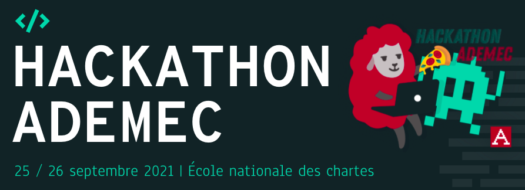

# VisualQuicherat

## Allers et retours d'un chartiste: récit de Jules Quicherat
Par l'équipe ALOA:

## Le projet

## Roadmap

### Les jeux de données

- [x] this is a complete item
- [ ] this is an incomplete item

### L

## Organisation du repository

Ce projet a été réalisé dans le cadre du Hackathon ADEMEC 2021

#### Description

*Application de visualisations chrono-spatiales des chartistes à travers les voyages de Quicherat.*

